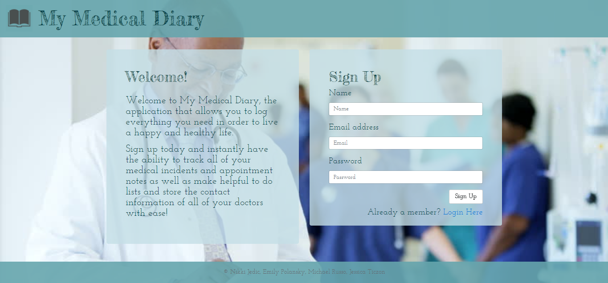
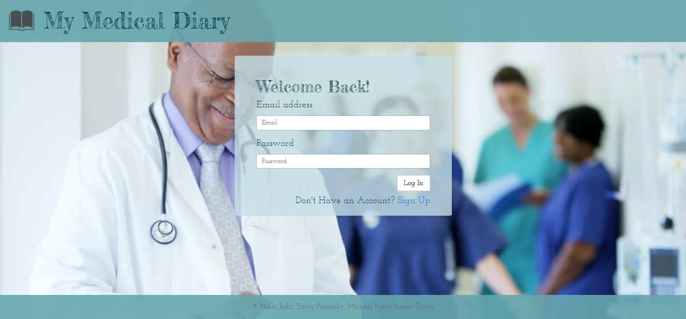
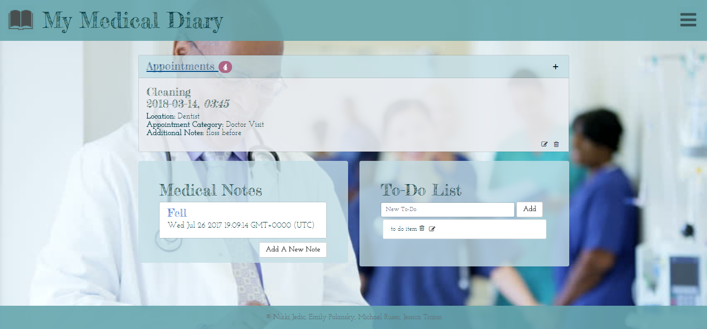
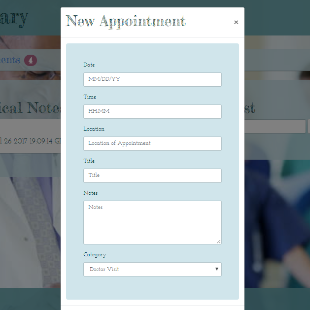
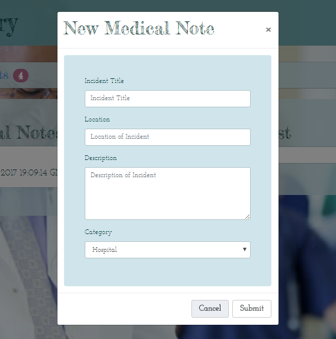
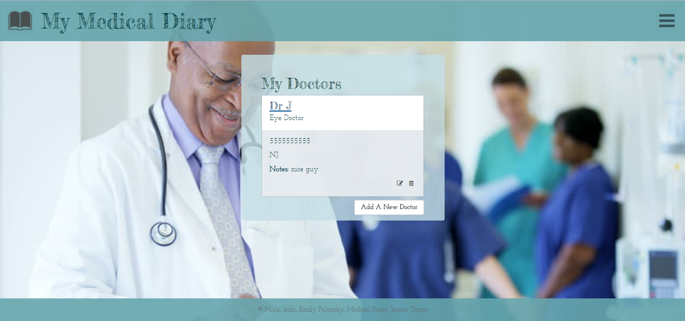
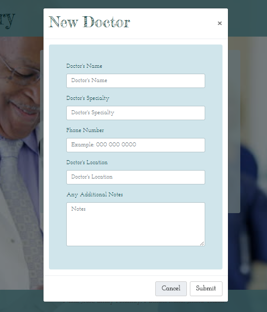

# My Medical Diary

My Medical Diary is a full stack application that stores the users notes, appointments, to dos, and doctors within a mySQL database. This application keeps all of the users medical information in one place in order to make life easier. 

## Use of application 

This application allows the user to create an account.

Or if the user already has an account they can sign in.

Once the user has signed in they are brough to their dashboard page. 

Here the user can add doctors appointments, to do items, and notes about medical instances. The user also has the ability to update and delete appointments, notes, and to do items. 

If the user navigates to the nav bar, there is a drop down in the right corner. If the users clicks on 'My Doctors', they are brought to the doctors page which lists all of the users doctors and their contact information. 

Like the main dashboard page, the user can add new doctors, update existing ones, and delete doctors. 

If the user navigates back to the nav bar drop down, they can also click the option to log out of the account. They will then be redirected back to the signIn page. 

## Languages and Packages Used

This application used HTML, CSS, Bootstrap4, node.js, javascript, and mySQL.

The node packages used were sequelize, handlebars, express, body-parser, and method-override.

